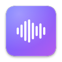
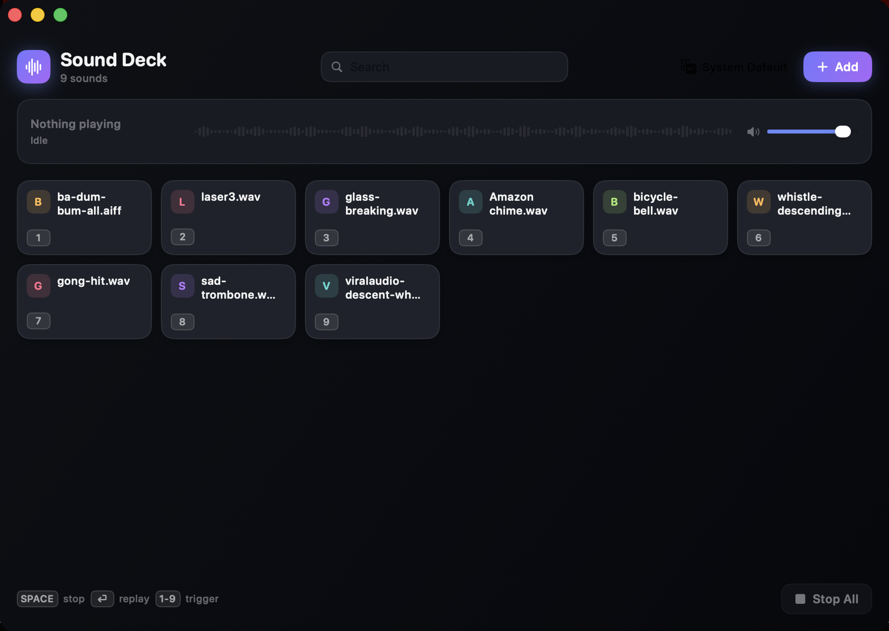

# Sound Deck

<p align="center">
  
</p>

<p align="center">
  
</p>

Sound Deck is a soundboard for macOS. Add your audio files to the deck. Press a key to play them. Send the audio to your speakers or to a call.

## Features

### Playback

- Sounds play at the same time. A new sound does not stop the previous sound.
- Each sound has its own volume level. The deck also has a master volume.
- Sounds fade out when they stop. They do not cut off.
- You can trim a sound to a shorter section.
- You can set a sound to loop.
- The deck shows a waveform and a playhead during playback.

### Triggers

- Each pad has a keyboard key. Press the key to play the pad.
- Global hotkeys work in all applications. Press Control-Option and the key of the pad.
- The menu bar icon opens a compact deck. You do not have to open the main window.
- Press Space to stop all sounds. Press Return to play the last sound again.

### Output

- You can select the output device.
- Select a virtual device to send the audio to a call or to a stream.
- The device menu shows virtual devices in a separate group.

### Library

- Drag audio files onto the window to add them. You can add more than one file.
- You can search the deck.
- You can drag a pad to a new position.
- You can rename a pad.
- You can set a colour and an emoji for each pad.

## Send the audio to a call

The deck sends audio to your speakers. Other people in a call cannot hear this audio. To send the audio to a call, do the steps that follow.

1. Install a virtual audio device. To install BlackHole, type `brew install blackhole-2ch`.
2. In Sound Deck, open the output menu in the header.
3. Select the virtual device from the **Virtual** group.
4. In Zoom, Discord, Meet or OBS, set the microphone to the same virtual device.

The call now receives the audio from the deck. The call does not receive your voice.

To send your voice and the deck audio together, do the steps that follow.

1. Open Audio MIDI Setup.
2. Create an aggregate device.
3. Add your microphone and the virtual device to the aggregate device.
4. Set the microphone of the call to the aggregate device.

To play sounds without leaving the call window, enable global hotkeys. Click the menu bar icon. Set **Global hotkeys** to on. Press Control-Option and the key of a pad.

## Requirements

- macOS 14.6 or later
- Xcode 16 or later to build the application

## Build

To build the application in Xcode, do the steps that follow.

1. Clone the repository.
2. Open `SoundDeck.xcodeproj`.
3. Press Command-R.

To build the application from a terminal, type the command that follows.

```bash
xcodebuild -project SoundDeck.xcodeproj -scheme SoundDeck -configuration Debug build
```

## The application does not use the sandbox

Sound Deck does not use the App Sandbox. This is deliberate.

The application uses bookmarks to keep access to the files that you add. The system attaches a security-scoped bookmark to the code signature of the application. This project uses an ad-hoc signature, because it does not assume a paid Apple Developer account. An ad-hoc signature has no identity. Therefore the system cannot create a security-scoped bookmark. The operation fails with error 256 in `NSCocoaErrorDomain`. The file is readable, but the operation still fails.

A plain bookmark cannot restore access in the sandbox. A sandboxed application with an ad-hoc signature loses all added sounds at the next start.

The application does not use the sandbox. Plain bookmarks are correct in this condition. macOS can ask for access to a folder such as Downloads. This is a standard TCC request. Give the access one time.

If you have an Apple Developer Team ID, do the steps that follow.

1. Set the Team ID on the target.
2. Add the three entitlement keys from `SoundDeck/SoundDeck.entitlements`.

The application tries a security-scoped bookmark first. It uses a plain bookmark only if the first operation fails. Therefore the application changes to security-scoped bookmarks automatically.

## Credits

- Built with SwiftUI, AVFoundation and CoreAudio
- The script `Tools/MakeIcon.swift` creates the application icon

---

Send your requests and problem reports to the issue tracker.
